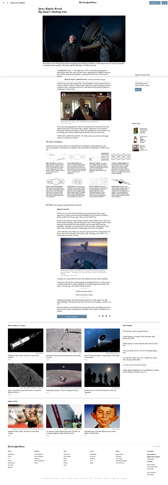

# Floats-and-positioning

This is the third project of the Main HTML/CSS curriculum at Microverse - @microverseinc.

- The goal was to create a clone of [this](https://www.nytimes.com/2014/03/18/science/space/detection-of-waves-in-space-buttresses-landmark-theory-of-big-bang.html?_r=0) New York Times article page.
- The project was completed using simple html and css.

[Assignment link](https://microverse.pathwright.com/library/fast-track-curriculum/69047/path/step/59538403/)

Authors:

- [@BenjaminGarza](https://github.com/BenjaminGarza)
- [@archemiro](https://github.com/archemiro)
